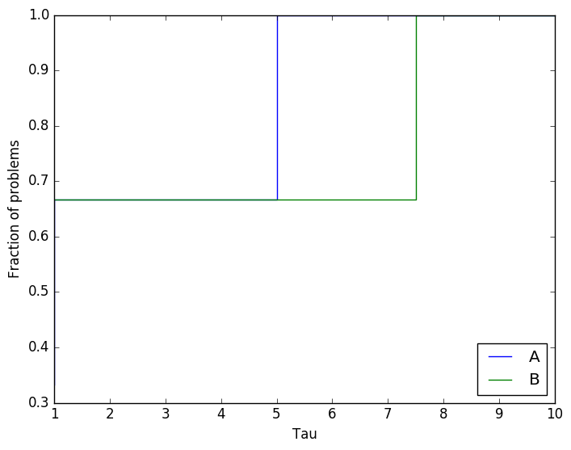
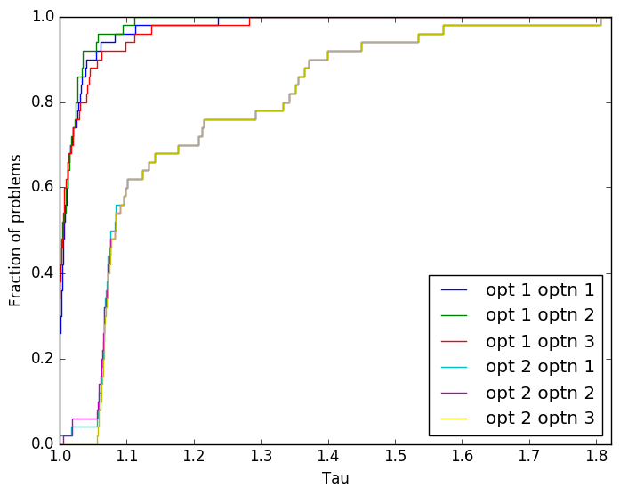
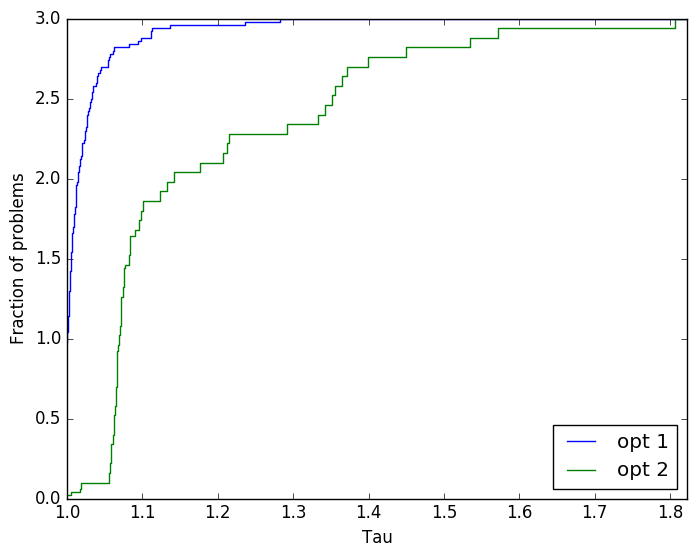

# Performance profiles in Python
Generating performance profiles for optimization software in Python.

## Why performance profiles?
Performance profiles, as developed by E. D. Dolan and J. J. More, are a powerful tool to assess the performance of optimization software. For this reason they are becoming increasingly accepted within the optimization community.

## Why another function for performance profiles?
Performance profiles can be drawn using different packages available on GitHub (simple search does the trick). In my personal use of performance profiles, I wanted to draw many different performance profiles using the same data by aggregating information. The available packages do not allow me to do so without tedeous reordering of data. This function makes it easy and modifications of the data are not required.

## Getting started using this simple example
In order to generate the performance profile do the following:
1. Import the module.
2. Generate a Pandas dataframe using your data.
3. Run the function! 

The mentioned steps will be further explained using a simple example.

### Importing the module
First let's import `pandas`, `numpy` and `optperfprofpy`.
```python
import pandas as pd
import numpy as np
import optperfprofpy
```
### Generating the dataframe
The unique flexibility of this function is possible due to the use of the high-performance data analysis package **pandas** (http://pandas.pydata.org). Although pouring your data 
into a dataframe might seem like a tedious task, the flexibility of the profile function will quickly make up for that. Furthermore, from that dataframe you can access many of 
the powerful and easy pandas funcions. For examples of how to generate a dataframe from a CSV, HDF5 or Excel see 
http://pandas.pydata.org/pandas-docs/stable/10min.html#getting-data-in-out .

In the simple example we will compare the performance (objective values) of two methods amongst three problems. We create the columns for the performance profiles using 
`pandas.Series`.
```python
problems = pd.Series([1, 1, 2, 2, 3, 3], dtype=int, name='problem')
methods = pd.Series(['A', 'B', 'A', 'B', 'A', 'B'], dtype=str, name='method')
objective_vals = pd.Series([2, 20, 25, 5, 30, 4], dtype=float, name='obj')
```
The dataframe is created by stacking these together.
```python
example_df = pd.DataFrame([problems, methods, objective_vals]).T
```
The resulting dataframe is shown below.

|  | problem | method | obj |
|-------| ------- | ------ | --- |
| 0 | 1 | A | 2 |
| 1 | 1 | B | 20 |
| 2 | 2 | A | 25 |
| 3 | 2 | B | 5 | 
| 4 | 3 | A | 30 |
| 5 | 3 | B | 4 |

This dataframe contains everything required for a performance profile:
1. Problems defined by a **problem definition**. In this case simply a number: problem 1, problem 2.
2. All problems are solved by methods, these are the **solver characteristics**, in this case labelled by method A and B.
3. We compare the methods by looking at their obj which is a **performance measure**.
Along with the dataframe, these three indices are all that is required to generate the performance profile.

### Generating the profile
The dataframes and three indices are entered into the function as following:
```python
taus, solver_vals, solvers, transformed_data = optperfprofpy.calc_perprof(example_1, ['problem'], ['obj'], ['method'])
```
The functions returns the tau values for the x axis and the solver values for the y axis. The performance profile module contains a simple plotting function using matplotlib. The following code generates the performance profile below.
```python
optperfprofpy.draw_simple_pp(unique_taus, solver_vals, solvers)
```


The performance profile indicates that both methods solve the same amount of problems best. But method A solves all problems within a factor 5 of method B, while method B solves the last problem a factor 7.5 times worse than method A.

## The true power: an extensive example
In order to demonstrate the true power of the performance profile function a large database is used, called `extended_df`. The database contains 150 unique problems defined by three variables, `var_1, var_2, var_3`. These problems are solved by six unique solvers, which are characterized by the labels `solv_var_1` and `solv_var_2`. Once the solver is finished the objective function value `obj` and number of iterations `iters` is saved. Furthermore, the feasibility to meet some problem specific value is tested, and added in the column `feas`. The first unique problem is shown below.

|   | var_1 | var_2 | var_3 | solv_var_1 | solv_var_2 | obj | iters | feas  |
|---|-------|-------|-------|------------|------------|-----|-------|-------|
| 1 | 120   | 60    | 0.1   | opt_1      | optn_1     | 494 | 1000  | True  |
| 2 | 120   | 60    | 0.1   | opt_1      | optn_2     | 468 | 1031  | True  |
| 3 | 120   | 60    | 0.1   | opt_1      | optn_3     | 489 | 356   | True  |
| 4 | 120   | 60    | 0.1   | opt_2      | optn_1     | 713 | 1000  | False |
| 5 | 120   | 60    | 0.1   | opt_2      | optn_2     | 634 | 1031  | False |
| 6 | 120   | 60    | 0.1   | opt_2      | optn_3     | 475 | 1010  | False |


Let's start and draw a performance profile of `obj` of the unique solvers using the code:
```python
prob_def = ['var_1', 'var_2', 'var_3']
perf_meas = ['obj']
solver_char = ['solv_var_1', 'solv_var_2']

taus, solver_vals, solvers, transformed_data = optperfprofpy.calc_perprof(extended_df, prob_def, perf_meas, solver_char)
```
A performance profile is drawn using:
```python
optperfprofpy.draw_simple_pp(taus, solver_vals, solvers)
```
which results in the profile below.



Note that all unique combinations (six in total) of `solv_var_1` and `solv_var_2` are present in the profile. Now a profile where the performance measure is `iters` instead of `obj` is a piece of cake: simply change the definition of the performance measure fed to the funcion. Try it out! In the profile above many curves lie on top of one another for the optimizer `opt 2`. This is due to the optimizer being penalized when the feasibility is `False`. This means the performance measure of that method is assigned the worst performance measure of all methods for that problem multiplied by 1.05. This value is slightly larger than one in order to distinguish between the methods that obtain the worst occuring result and methods that do not obtain a feasible result. 
Removing the column from the dataframe before generating the profile prevents non-feasible optimizers being penalized. This can be done by using the following code:
```python
taus, solver_vals, solvers, transformed_data = calc_perprof(extended_df.drop('feas', axis=1), prob_def, perf_meas, solver_char)
```

Another option is aggregating certain profiles. Say we want to distinguish between the unique solver variables `solv_var_1` but not by `solv_var_2`. This is done by removing `solv_var_2` from the `solver_var` characteristic. Keeping the rest the same we thus use:
```python
solver_char = ['solv_var_1']
```
a `warning` is printed to indicate information has been aggregated. The resulting profile is shown below.



### Future work
1. Add description of why performance profiles are useful.
2. Add description of when a data set is large enough to be used for a performance profile.
3. Add description of when two curves in a performance profile are significantly different.

## References
[1]:
  	E. D. Dolan, and J. J. More,
    **Benchmarking Optimization Software with Performance Profiles.**
    _Math. Programming_, 91:201-213, 2002.


